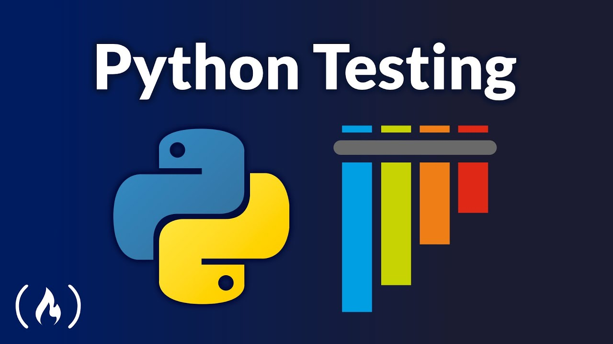

# Testing-con-Python

# En este espacio, todo aquel que lo desee podrá pasarme un código y yo intentaré hacer un test del mismo.
# TODOS los consejos, sugerencias, anotaciones, indicaciones, críticas (siempre que sean CONSTRUCTIVAS), comentarios, etc son y serán BIENVENIDOS.
<a href="mailto:loquelojonove1975@gmail.com" target="_blank" title="Email" rel="noopener"></i></a>
